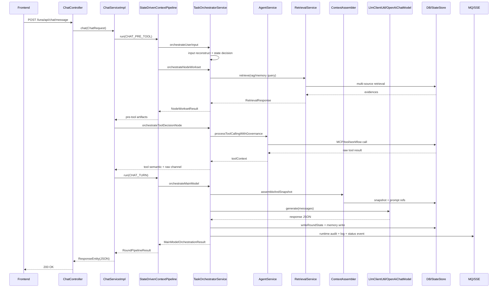

# 项目源码深度分析报告

> 基于仓库 `F:/YilenaCode/Luna` 当前源码静态审计结果输出。  
> 结论均有对应代码路径，未编造类、方法、调用链。

## 1. 项目概览

### 1.1 技术与架构特征
- 核心框架：Spring Boot + Spring MVC + MyBatis-Plus + RocketMQ + SSE。
- AI 运行方式：LangChain4j `OpenAiChatModel` 手工调用（非 `AiServices + @Tool` 自动代理）。
- 架构风格：状态驱动编排（State-Driven Pipeline）+ 多阶段治理（重建/召回/重排/组装/执行/回写）。
- 启动入口：`RunaApplication` 启用了 `@EnableScheduling`、`@EnableAsync`、`@MapperScan`。  
  见 [RunaApplication](/F:/YilenaCode/Luna/src/main/java/org/yilena/luna/RunaApplication.java:15)。

### 1.2 关键事实（源码确认）
- 未发现 `@EventListener` 事件监听入口。
- 未发现 webhook 专用路由/处理器。
- LLM 主调用在 `LlmClientUtil.generate()`，内部执行 `OpenAiChatModel.generate(messages)`。  
  见 [LlmClientUtil](/F:/YilenaCode/Luna/src/main/java/org/yilena/luna/utils/LlmClientUtil.java:80)。
- 无 LangChain4j token streaming；SSE 仅用于状态广播和异步结果事件。  
  见 [LunaStatusController](/F:/YilenaCode/Luna/src/main/java/org/yilena/luna/controller/LunaStatusController.java:25)。
- `LunaAgentConfig` 明确声明已切换到 MCP 手工编排，不再依赖 `AiServices/@Tool`。  
  见 [LunaAgentConfig](/F:/YilenaCode/Luna/src/main/java/org/yilena/luna/config/LunaAgentConfig.java:20)。

## 2. 系统入口分析

## 2.1 Controller 入口（HTTP）

### 2.1.1 对话与状态
| 类 | 方法 | URL | 请求类型 | 入参结构 |
|---|---|---|---|---|
| `ChatController` | `chat` | `POST /luna/api/chat/message` | JSON | `ChatRequest{userInput}` |
| `ChatController` | `startup` | `POST /luna/api/chat/startup` | 无/JSON | 无 |
| `ChatController` | `shutdown` | `POST /luna/api/chat/shutdown` | 无/JSON | 无 |
| `ChatController` | `getHistoryDate` | `GET /luna/api/chat/history/date` | Query | `ym` |
| `ChatController` | `getHistory` | `GET /luna/api/chat/history` | Query | `ymd` |
| `LunaStatusController` | `stream` | `GET /api/luna/status/stream` | SSE | `HttpServletResponse` |
| `LunaStatusController` | `disconnect` | `GET /api/luna/status/disconnect` | Query | 无 |

### 2.1.2 认证
| 类 | 方法 | URL | 请求类型 | 入参结构 |
|---|---|---|---|---|
| `AuthController` | `login` | `POST /auth/login` | JSON | `LoginRequest{username,password}` |
| `AuthController` | `logout` | `POST /auth/logout` | Header | `Authorization` |

### 2.1.3 RAG 与计划编排
| 类 | 方法 | URL | 请求类型 | 入参结构 |
|---|---|---|---|---|
| `RagController` | `retrieve` | `POST /luna/api/rag/retrieve` | JSON | `RetrievalRequest` |
| `PlanOrchestratorController` | `run` | `POST /luna/api/plan/run` | JSON | `PlanRunRequest{sessionId,userGoal}` |
| `PlanOrchestratorController` | `runPhase` | `POST /luna/api/plan/phase/run` | JSON | `PlanPhaseRunRequest{planId,phaseId}` |
| `PlanOrchestratorController` | `finalizeReport` | `POST /luna/api/plan/report/finalize` | JSON | `PlanFinalizeRequest{planId}` |
| `PlanOrchestratorController` | `getPlanGraph` | `GET /luna/api/plan/graph/{planId}` | Path | `planId` |

### 2.1.4 MCP 协议与资源
| 类 | 方法 | URL | 请求类型 | 入参结构 |
|---|---|---|---|---|
| `ApprovalController` | `submitApproval` | `POST /mcp/tools/approval` | JSON | `Map{taskId,approved}` |
| `LegacyApprovalAliasController` | `submitApprovalLegacyAlias` | `POST /mcp/skills/approval` | JSON | `Map{taskId,approved}` |
| `McpJsonRpcController` | `invoke` | `POST /mcp/rpc` | JSON-RPC | `Map{id,method,params}` |
| `McpController` | `listTools` | `GET /mcp/tools/list` | Query | `serverCode?` |
| `McpController` | `callTool` | `POST /mcp/tools/call` | JSON | `Map{serverCode,toolName,argumentsJson}` |
| `McpController` | `listPrompts` | `GET /mcp/prompts/list` | Query | `serverCode?` |
| `McpController` | `getPrompt` | `POST /mcp/prompts/get` | JSON | `Map{serverCode,promptName,argumentsJson}` |
| `McpController` | `listResources` | `GET /mcp/resources/list` | Query | `serverCode?` |
| `McpController` | `readResource` | `POST /mcp/resources/read` | JSON | `Map{serverCode,resourceUri}` |
| `McpController` | `syncCatalog` | `POST /mcp/catalog/sync` | JSON | 无 |
| `McpController` | `upsertServerRegistry` | `POST /mcp/migrate/server-registry` | JSON | `McpServerRegistry` |
| `McpController` | `upsertToolCatalog` | `POST /mcp/migrate/tool-catalog` | JSON | `McpToolCatalog` |
| `McpController` | `upsertToolImplMapping` | `POST /mcp/migrate/tool-impl-mapping` | JSON | `McpToolImplMapping` |
| `McpController` | `upsertPromptCatalog` | `POST /mcp/migrate/prompt-catalog` | JSON | `McpPromptCatalog` |
| `McpController` | `upsertResourceCatalog` | `POST /mcp/migrate/resource-catalog` | JSON | `McpResourceCatalog` |
| `McpController` | `upsertWorkflowTemplate` | `POST /mcp/migrate/workflow-template` | JSON | `WorkflowTemplate` |

### 2.1.5 查询接口
| 类 | 方法 | URL | 请求类型 | 入参结构 |
|---|---|---|---|---|
| `KnowledgeBaseController` | `page` | `POST /luna/api/query/knowledge-base[/page]` | JSON | `KnowledgeBasePageQueryRequest` |
| `LunaLogController` | `page` | `POST /luna/api/query/log[/page]` | JSON | `LunaLogPageQueryRequest` |
| `MemoryController` | `page` | `POST /luna/api/query/memory[/page]` | JSON | `MemoryPageQueryRequest`（返回 410） |
| `UserPreferenceController` | `page` | `POST /luna/api/query/user-preference[/page]` | JSON | `UserPreferencePageQueryRequest`（返回 410） |

### 2.1.6 Prompt 治理接口（Admin）
`PromptAdminController` 暴露分类、条目、版本、策略、预览等完整管理 API（`/api/prompt/**`），包括：
- `GET /categories /categories/detail /categories/tree`
- `GET /items /item/detail /item/detail-by-id /item/exists /item/key-values /item/versions /item/version/detail`
- `POST /search /item/create /item/update /item/save /item/delete /item/activate /item/rollback /item/draft /item/archive /item/diff`
- `POST /preview/match /preview/assemble`
- `GET /policy/list /policy/detail /policy/versions`
- `POST /policy/save /policy/delete /policy/activate`

代码：  
[PromptAdminController](/F:/YilenaCode/Luna/src/main/java/org/yilena/luna/prompt/governance/api/PromptAdminController.java:31)

## 2.2 Webhook 入口
- 源码扫描未发现 webhook 入口（无 webhook 路由与处理器）。

## 2.3 定时任务入口（@Scheduled）
| 类 | 方法 | 触发条件 | 入参 |
|---|---|---|---|
| `EventInboxDispatcher` | `dispatchPendingEvents()` | `fixedDelayString=luna.event.dispatcher.delay-ms`（默认 5000ms） | 无 |
| `OfflineMemoryLearningJob` | `runDailyLearning()` | `cron=luna.memory.learning.cron`（默认 `0 20 3 * * *`） | 无 |
| `McpCatalogMigrationJob` | `validateAndMigrate()` | `cron=luna.mcp.migration.validation.cron`（默认每 30 分钟） | 无 |

## 2.4 消息队列消费者入口（RocketMQ）
| 类 | 方法 | Topic | Group | 入参 |
|---|---|---|---|---|
| `ContextSummaryConsumer` | `onMessage` | `TOPIC_SUMMARY` | `GROUP_SUMMARY` | `SummaryMessage` |
| `KnowledgeBaseConsumer` | `onMessage` | `TOPIC_KB_ADD` | `GROUP_KB_ADD` | `KnowledgeBaseMessage` |
| `LunaLogConsumer` | `onMessage` | `TOPIC_LOG` | `GROUP_LOG` | `LogMessage` |
| `SkillExecutionConsumer` | `onMessage` | `TOPIC_WORKFLOW_ASYNC` | `GROUP_WORKFLOW_ASYNC` | `SkillExecutionMessage` |

## 2.5 ApplicationRunner / CommandLineRunner
| 类 | 入口 | 触发 | 功能 |
|---|---|---|---|
| `SwaggerStartupPrinter` | `run(ApplicationArguments)` | 启动后 | 打印 Swagger/OpenAPI 地址 |
| `PromptGovernanceBootstrap` | `run(ApplicationArguments)` | 启动后 | Prompt 分类/内置项迁移与初始化 |
| `GlobalConfig` | `ddlApplicationRunner(...)` | Bean 初始化 | 启动执行 DDL runner |

- 未发现 `implements CommandLineRunner`。

## 2.6 事件监听入口（@EventListener）
- 未发现。

## 2.7 AOP 切入点
| 切面类 | 切点表达式 | 生效对象 | 核心影响 |
|---|---|---|---|
| `LunaLogAspect` | `@Around("@annotation(lunaLogRecord)")` | 标注 `@LunaLogRecord` 的方法 | 采集 request/response/异常并异步发 MQ |
| `LunaStateAspect` | `@Around("@annotation(lunaState)")` | 标注 `@LunaState` 的方法 | 执行前后推送 SSE 状态 |

---

## 3. 接口调用链分析

## 3.1 聊天主接口 `POST /luna/api/chat/message`

### 完整调用链
`ChatController.chat(ChatRequest)`  
→ `ChatServiceImpl.chat(ChatRequest)`  
→ `StateDrivenContextPipelineImpl.run(StateDrivenContextPipelineRequest{CHAT_PRE_TOOL})`  
→ `TaskOrchestratorServiceImpl.orchestrateUserInput(sessionId,input)`  
→ `TaskOrchestratorServiceImpl.orchestrateNodeWorkset(sessionId,input,decision,contextPackage,reconstruction)`  
→ `TaskOrchestratorServiceImpl.orchestrateToolDecisionNode(...)`  
→ `AgentServiceImpl.processToolCallingWithGovernance(ToolDecisionCommand)`  
→ `ToolExecutionGateway.executeTool / McpService / WorkflowExecutor`  
→ `StateDrivenContextPipelineImpl.run(StateDrivenContextPipelineRequest{CHAT_TURN})`  
→ `RoundPipelineOrchestratorImpl.executeRound(RoundPipelineRequest)`  
→ `TaskOrchestratorServiceImpl.orchestrateMainModel(MainModelExecutionRequest)`  
→ `TaskOrchestratorServiceImpl.invokeMainModel(prompt,...)`  
→ `LlmClientUtil.generate(LlmRequest)`  
→ `OpenAiChatModel.generate(List<ChatMessage>)`  
→ `TaskOrchestratorServiceImpl.writeRoundState(...)`  
→ `ChatServiceImpl` 返回 `ResponseEntity<JsonNode>`

### 分层参数与返回（关键层）
- Controller 层：
  - 入参：`ChatRequest{userInput}`
  - 返回：`ResponseEntity<Object>`
- Service 编排层：
  - 入参：`sessionId + userInput`
  - 返回：`RoundPipelineResult / MainModelOrchestrationResult`
- AI 调用层：
  - 入参：`LlmRequest{modelType,modelName,messages,temperature,enablePromptInjectionCheck}`
  - 返回：`LlmResponse{content}`
- 数据层：
  - 入参：mapper 查询参数（session、planId、nodeId、query、refs）
  - 返回：状态快照、检索证据、工具执行轨迹

## 3.2 RAG 接口 `POST /luna/api/rag/retrieve`

### 完整调用链
`RagController.retrieve(RetrievalRequest)`  
→ `TaskOrchestratorServiceImpl.orchestrateUserInput(...)`（治理）  
→ `TaskOrchestratorServiceImpl.orchestrateNodeWorkset(...)`（产出 `governedQuery`）  
→ `RetrievalServiceImpl.retrieve(governedRequest)`  
→ `QueryProcessor.process(request)`  
→ `RouteSelector.selectPlan(queryObject,request)`  
→ `RetrievalPipeline.execute(...)`（按 route 进入具体 pipeline）  
→ `AbstractRetrievalPipeline.retrieveBySources(...)`  
→ `KnowledgeRetriever/MemoryRetriever/...`  
→ `PgRetrievalAdapter + DB`  
→ 返回 `RetrievalResponse`

## 3.3 计划编排接口 `POST /luna/api/plan/run`

### 完整调用链
`PlanOrchestratorController.run(PlanRunRequest)`  
→ `PlanOrchestratorServiceImpl.createAndRunPlan(sessionId,userGoal)`  
→ `MasterPlanningServiceImpl.generateBlueprint(...)`  
→ `LlmClientUtil.generate(LlmRequest)`（生成蓝图）  
→ 写入 `plan/phase/node`  
→ `PhaseExecutionService.executePhase(...)`  
→ 返回 JSON 结果

## 3.4 MCP 协议接口 `POST /mcp/rpc` 与 `/mcp/tools/call`

### 完整调用链
`McpJsonRpcController.invoke(body)` 或 `McpController.callTool(body)`  
→ `McpServiceImpl.callTool(serverCode,toolName,argumentsJson)`  
→ `LocalMcpClientAdapter.callTool(...)`  
→ 本地分支：`LocalMcpServerServiceImpl.callTool(...)`  
→ `LocalMcpToolHandler` / 路由调用 / Spring Bean 兼容调用  
→ 返回 `McpToolCallResult`

## 3.5 Prompt 管理接口 `/api/prompt/**`

### 完整调用链（按功能组）
- 查询类：`PromptAdminController.categories/items/detail/search`  
  → `PromptQueryService/PromptRegistryService/PromptCategoryService`
- 变更类：`create/update/save/delete`  
  → `PromptMutationService`
- 版本类：`versions/version detail/activate/rollback/draft/archive/diff`  
  → `PromptVersionService`
- 策略类：`policy/list/detail/save/delete/versions/activate`  
  → `PromptPolicyService`
- 预览类：`preview/match/preview/assemble`  
  → `PromptPreviewService`（内部基于 `PromptResolveContext`）

---

## 4. 主链路拆解（重点）

主链路：`POST /luna/api/chat/message`  
数据流目标：`Request -> DTO -> Prompt -> AI -> Result -> VO(Response)`

## 【阶段1：请求进入（Spring MVC 分发）】
1. 做了什么  
请求命中 `ChatController.chat(@RequestBody ChatRequest)`，由 Spring MVC 完成路由匹配和 JSON 反序列化，随后将 DTO 透传给 `ChatServiceImpl.chat`。
2. 用了什么  
`@RestController`、`@RequestMapping("/luna/api/chat")`、`@PostMapping("/message")`、Jackson 反序列化。
3. 作用是什么  
统一 HTTP 协议边界，隔离协议层和编排层，使业务链路不直接依赖 Servlet API。
4. 关键细节  
该路径在 `WebMvcConfig` 中未被排除，需通过 `AuthInterceptor` 才会进入 Controller（除登录和状态流等白名单）。

## 【阶段2：参数解析与校验】
1. 做了什么  
`ChatServiceImpl.chat` 从 `chatRequest.userInput` 读取输入并 `trim`，空字符串立即 `400` 返回。
2. 用了什么  
`Optional.ofNullable(...).map(...).orElse("")` 与 `ResponseEntity.badRequest()`。
3. 作用是什么  
降低后续治理与模型调用开销，避免空请求污染状态。
4. 关键细节  
校验在 Service 手工完成，而非 `@Valid` 注解校验。

## 【阶段3：业务逻辑调度】
1. 做了什么  
进入两段式状态流水线：先执行 `CHAT_PRE_TOOL`，拿到 `decision/context/reconstruction/nodeWorkset`；再做工具决策；最后执行 `CHAT_TURN` 形成主回复并写回状态。
2. 用了什么  
`StateDrivenContextPipelineImpl`、`RoundPipelineOrchestratorImpl`、`TaskOrchestratorServiceImpl`。
3. 作用是什么  
将“输入治理”和“模型回复”解耦，保证工具选择、RAG 召回、记忆注入先完成再生成答案。
4. 关键细节  
`preToolPipelineResult` 缺关键产物会直接 503 阻断，避免非治理上下文进入主模型。

## 【阶段4：AI 调用（LangChain4j）】
1. 做了什么  
`orchestrateMainModel` 调用 `contextAssembler.assembleAndSnapshot` 组装终态 Prompt，再由 `invokeMainModel` 构建 `LlmRequest`，通过 `LlmClientUtil.generate` 调用 `OpenAiChatModel.generate(messages)`。
2. 用了什么  
LangChain4j `OpenAiChatModel`、`LlmRequest/LlmMessage/LlmResponse`、`PromptResolverService`、`ContextAssembler`。
3. 作用是什么  
把系统状态、记忆、工具语义、RAG 证据组合成可执行 Prompt，并统一模型调用协议。
4. 关键细节  
若主模型返回 JSON 不合法，会触发 repair prompt 二次修复；修复仍失败则 fallback 到固定 JSON 响应。

## 【阶段5：外部依赖调用（DB / Redis / API）】
1. 做了什么  
主链路会触发 RAG 检索（数据库向量/关键词检索）、MCP/工具调用（本地或远端）、状态存储与审计写入；异步技能场景写 Redis 任务状态并推 SSE。
2. 用了什么  
MyBatis Mapper、`McpService`、`LocalMcpClientAdapter`、`StringRedisTemplate`、`RocketMQTemplate`。
3. 作用是什么  
让模型不仅“生成文本”，还能与外部能力和长期状态联动。
4. 关键细节  
工具结果先进入 `rawToolResultChannel`，再做语义压缩，保留“可追溯原始证据”。

## 【阶段6：结果处理】
1. 做了什么  
对模型输出执行结构校验、`reply` 抽取、`thought` 清理；执行 `MemoryWriteGate` 决策是否写记忆；落库回放治理数据。
2. 用了什么  
`tryParseJsonNode`、`removeThoughtFromJson`、`evaluateMemoryWriteGate`、`memoryWritePipelineService`。
3. 作用是什么  
确保返回对前端稳定可消费，同时控制记忆质量和存储成本。
4. 关键细节  
日志切面通过 `LunaLogAspect.LOG_RESPONSE_OVERRIDE` 覆盖日志响应体，保证日志记录与最终回复一致。

## 【阶段7：响应返回】
1. 做了什么  
成功路径返回 `ResponseEntity.ok(validJsonNode)`；治理阻断路径返回 503；参数错误返回 400。
2. 用了什么  
`ResponseEntity`、`GlobalExceptionHandler`。
3. 作用是什么  
向上游提供统一响应契约和错误语义。
4. 关键细节  
若业务抛出 `NeedApprovalException`，全局异常会转成 `pending_approval` 业务态而非 500。

---

## 5. LangChain4j 深度分析（重点）

## 5.1 AI 调用入口
- 主回复入口：`TaskOrchestratorServiceImpl.invokeMainModel(...)`。
- 工具决策入口：`AgentServiceImpl` 使用 `RealLlmAdapter.generate()`（仍落到 `LlmClientUtil`）。
- 规划入口：`MasterPlanningServiceImpl.generateBlueprint()`。
- 统一落点：`LlmClientUtil.generate()`。

## 5.2 Prompt 构造过程
- 主链路构造：
  - `TaskOrchestratorServiceImpl.orchestrateMainModel()` 调 `resolveMainModelPromptAssembly()` 获取治理中心匹配结果。
  - `DefaultContextAssembler.assembleAndSnapshot()` 构造多 section 上下文，并注入 slot prompt。
  - `SemanticPreservingPruner` 按预算裁剪后生成 `finalPrompt`。
- 模板来源：
  - 默认模板来自 `PromptTemplates`；
  - 如启用 Prompt 治理，优先 `PromptResolverService/PromptRegistryService` 解析动态模板与策略包。
- system/user 区分：
  - `LlmClientUtil` 将 `system` 消息拼接 `SYSTEM_SECURITY_NOTICE`；
  - `user` 文本包裹为 `<user_input>...</user_input>`。

## 5.3 Memory 机制
- 不使用 LangChain4j 内置 `ChatMemory`。
- 使用自研状态+记忆层：
  - `TaskState/RetrievalState/ToolState/ContextState` 每轮 `writeRoundState()` 更新。
  - `memoryWritePipelineService.writeAfterTurn()` 在门控通过后写入。
- 生命周期：
  - 轮次内：`CHAT_PRE_TOOL -> CHAT_TURN`；
  - 跨轮次：依赖 snapshot refs 与 state store 持久化。

## 5.4 Tool 调用机制
- 非 `@Tool` 自动调度。
- 调用链：
  - `orchestrateToolDecisionNode` 构造决策上下文；
  - `AgentServiceImpl.processToolCallingWithGovernance` 先 LLM 决策 action，再执行 `ToolExecutionGateway` 或 `McpService`。
- 工具语义化：
  - 原始结果进 `rawToolResultChannel`；
  - `ToolSemanticResult` 校验并规范化后进入后续组装。

## 5.5 RAG（存在）
- 检索流程：
  - `QueryProcessor`：normalize、改写、embedding、filter、source 推断；
  - `RouteSelector`：选择 `SEARCH/NATIVE/MODULAR/AGENTIC`；
  - `AbstractRetrievalPipeline`：多源并发、去重、重排、压缩、跨源融合；
  - `KnowledgeRetriever/MemoryRetriever` 执行数据库检索。
- 向量化来源：
  - `EmbeddingProvider`（底层使用 `LlmClientUtil.getEmbedding`，支持 HTTP 推理服务和本地脚本回退）。

## 5.6 Streaming / Agent 行为
- LangChain4j token streaming：未使用。
- SSE：用于状态事件与异步技能结果事件（如 `WORKFLOW_ASYNC_RESULT`）。
- 多轮行为：通过 `StateDrivenContextPipeline` 和快照状态实现，而非 LangChain4j Agent runtime。

---

## 6. 配置与初始化

## 6.1 核心配置类
- `RunaApplication`：启用调度、异步、Mapper 扫描、缓存、事务。
- `WebMvcConfig`：注册认证拦截器，配置内容协商和静态资源。
- `GlobalConfig`：创建 DDL Runner Bean。
- `LunaAgentConfig`：声明手工 MCP 架构。

## 6.2 属性 Bean
- `GeminiProperty`（`@ConfigurationProperties(prefix="gemini")`）提供 small/mid/big/flash/chat/code 模型配置。
- `EmbeddingProperty`（`prefix="embedding"`）提供本地 embedding 脚本参数。
- `RagProperties`（`prefix="luna.rag"`）驱动查询改写、路由策略、topK、超时等。

## 6.3 启动 Runner
- `SwaggerStartupPrinter`：启动打印文档地址。
- `PromptGovernanceBootstrap`：Prompt 分类与内置模板迁移/种子。
- `McpCatalogMigrationJob.migrateOnStartup()`：在开关开启时执行迁移。

---

## 7. 横切逻辑

## 7.1 Filter
- `RequestCachingFilter`：
  - 生效阶段：Servlet Filter 阶段，Controller 之前。
  - 作用：包装请求体供异常处理回读。
  - 特殊处理：SSE 流地址跳过包装。

## 7.2 Interceptor
- `AuthInterceptor`：
  - `preHandle` 校验 token，写入 `AuthContextHolder(sessionId/principal)`；
  - `afterCompletion` 清理 ThreadLocal；
  - 对主链影响：所有受保护 API 在业务前做鉴权与上下文注入。

## 7.3 AOP
- `LunaLogAspect`：
  - 在 `@LunaLogRecord` 方法周围采集请求参数、返回值、异常、耗时；
  - 异步发送到 `TOPIC_LOG`；
  - Broker 不可用时触发降级窗口，减少主流程阻塞风险。
- `LunaStateAspect`：
  - 方法执行前后推送状态事件，帮助前端感知系统状态。

## 7.4 全局异常处理
- `GlobalExceptionHandler`：
  - `AuthException` -> 401；
  - `NeedApprovalException` -> 200 + `pending_approval`；
  - 其他异常 -> 500 并交给 `ExceptionRetryService` 产出响应。

---

## 8. 数据流分析

## 8.1 聊天主链数据形态变化
1. `Request JSON`  
`{"userInput":"..."}`  
2. `DTO`  
`ChatRequest.userInput`  
3. `治理对象`  
`InputReconstructionResult + OrchestrationDecision + StructuredContextPackage + NodeWorksetResult`  
4. `Prompt`  
`AssembledContext.prompt`（多 section 合成）  
5. `AI 输出`  
`LlmResponse.content`（预期 JSON）  
6. `结构化结果`  
`ModelReply{raw,valid,replyText}`  
7. `返回对象`  
`ResponseEntity<JsonNode>`

## 8.2 并行旁路数据流
- 工具原始结果：`rawToolResultChannel`（含 latest ref/history refs/execution traces）。
- 状态快照：`TaskState/RetrievalState/ToolState/ContextState`。
- 审计轨迹：`runtimeAuditService.persistDecisionRecord(...)`。
- 异步日志：`LunaLogAspect -> RocketMQ TOPIC_LOG -> LunaLogConsumer -> DB`。

---

## 9. 时序图

---

## 10. 风险与优化建议

## 10.1 复杂度与职责边界
- 风险：`ChatServiceImpl` 与 `TaskOrchestratorServiceImpl` 体量大、职责交叉（治理、组装、调用、回写、审计）。
- 建议：按阶段拆分 Facade/UseCase（PreTool、ToolDecision、MainModel、RoundStateWriter）。

## 10.2 类型安全
- 风险：跨层大量 `Map<String,Object>`，容易出现 key 漂移和运行时错误。
- 建议：主链路通道（rawToolResultChannel、retrievalPlanOverrides、prompt refs）逐步改为强类型 record/VO。

## 10.3 校验一致性
- 风险：入参校验分散在 Service，Controller 缺统一注解校验。
- 建议：引入 `@Validated` + Bean Validation，统一错误模型。

## 10.4 AI 可靠性与可观测
- 风险：fallback JSON 虽稳态，但故障定位依赖日志阅读。
- 建议：增加指标（模型超时率、修复触发率、fallback 比例）与告警阈值。

## 10.5 MCP 多传输测试覆盖
- 风险：HTTP/RPC/WS/STDIO 分支多，边界故障复杂。
- 建议：建立传输层集成测试矩阵与统一错误码映射文档。

## 10.6 性能热点
- 风险：每轮多次状态审计与大量 JSON 组装，可能带来 CPU/IO 压力。
- 建议：审计写入分级采样（线上按严重级别），并对关键 mapper 查询加慢 SQL 观测。

---

## 附：关键源码索引
- 主链入口：
  - [ChatController](/F:/YilenaCode/Luna/src/main/java/org/yilena/luna/controller/ChatController.java:25)
  - [ChatServiceImpl](/F:/YilenaCode/Luna/src/main/java/org/yilena/luna/service/impl/ChatServiceImpl.java:104)
  - [StateDrivenContextPipelineImpl](/F:/YilenaCode/Luna/src/main/java/org/yilena/luna/service/impl/StateDrivenContextPipelineImpl.java:42)
  - [RoundPipelineOrchestratorImpl](/F:/YilenaCode/Luna/src/main/java/org/yilena/luna/service/impl/RoundPipelineOrchestratorImpl.java:104)
  - [TaskOrchestratorServiceImpl](/F:/YilenaCode/Luna/src/main/java/org/yilena/luna/service/impl/TaskOrchestratorServiceImpl.java:1104)
- LangChain4j 调用：
  - [LlmClientUtil](/F:/YilenaCode/Luna/src/main/java/org/yilena/luna/utils/LlmClientUtil.java:197)
- RAG：
  - [RetrievalServiceImpl](/F:/YilenaCode/Luna/src/main/java/org/yilena/luna/rag/api/RetrievalServiceImpl.java:29)
  - [QueryProcessor](/F:/YilenaCode/Luna/src/main/java/org/yilena/luna/rag/processor/QueryProcessor.java:30)
  - [RouteSelector](/F:/YilenaCode/Luna/src/main/java/org/yilena/luna/rag/router/RouteSelector.java:29)
- 横切：
  - [LunaLogAspect](/F:/YilenaCode/Luna/src/main/java/org/yilena/luna/annotation/aspect/LunaLogAspect.java:61)
  - [LunaStateAspect](/F:/YilenaCode/Luna/src/main/java/org/yilena/luna/annotation/aspect/LunaStateAspect.java:21)
  - [AuthInterceptor](/F:/YilenaCode/Luna/src/main/java/org/yilena/luna/interceptor/AuthInterceptor.java:20)
  - [GlobalExceptionHandler](/F:/YilenaCode/Luna/src/main/java/org/yilena/luna/exception/GlobalExceptionHandler.java:32)

