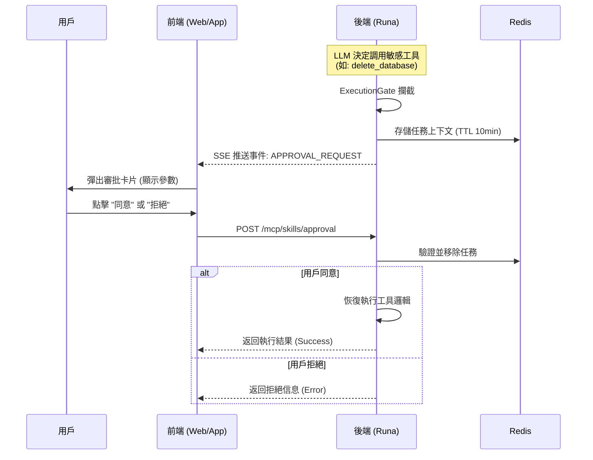

# MCP 敏感操作審批流前端集成指南

## 1. 概述
為了防止大模型（LLM）執行高風險操作（如刪除數據、發送郵件等），後端引入了 **Human-in-the-loop (HITL)** 機制。當 LLM 嘗試調用敏感度為 `MEDIUM` 或 `HIGH` 的 MCP Skill 時，後端會掛起執行流，並向前端發送審批請求。

前端需要完成以下工作：
1.  監聽服務端推送的 **審批請求事件**。
2.  彈出 **審批卡片/模態框** 展示操作詳情。
3.  調用後端接口提交 **同意** 或 **拒絕** 的結果。

---

## 2. 交互時序圖



---

## 3. 數據結構定義 (TypeScript)

請在前端項目中定義以下接口：

```typescript
/**
 * 審批任務對象
 * 對應後端 org.yilena.luna.entity.ApprovalTask
 */
export interface ApprovalTask {
  taskId: string;       // 任務唯一標識 (UUID)
  sessionId: string;    // 會話 ID
  skillName: string;    // 技能名稱 (如: "delete_user")
  beanName: string;     // 內部組件名
  methodName: string;   // 內部方法名
  argsJson: string;     // 參數 JSON 字符串 (需 JSON.parse 後展示)
  createTime: number;   // 創建時間戳
}

/**
 * SSE 推送的消息結構
 */
export interface ApprovalEvent {
  type: 'APPROVAL_REQUEST';
  payload: ApprovalTask;
}

/**
 * 提交審批請求的 Body
 */
export interface SubmitApprovalRequest {
  taskId: string;
  approved: boolean;
}
```

---

## 4. 集成步驟

### 4.1 監聽審批事件 (SSE / WebSocket)

在與後端建立的 SSE 連接（或 WebSocket）中，監聽類型為 `APPROVAL_REQUEST` 的事件。

> **注意**：具體的 SSE 建立方式取決於 `AgentService` 的實現，以下為處理邏輯示例。

```typescript
// 假設這是你的 SSE 監聽邏輯
eventSource.onmessage = (event) => {
  const data = JSON.parse(event.data);
  
  if (data.type === 'APPROVAL_REQUEST') {
    const task: ApprovalTask = data.payload;
    
    // 1. 解析參數以便展示
    const args = JSON.parse(task.argsJson);
    
    // 2. 觸發 UI 彈窗
    showApprovalModal({
      title: `⚠️ 敏感操作請求: ${task.skillName}`,
      description: `AI 正在請求執行敏感操作，請確認參數。`,
      args: args,
      taskId: task.taskId,
      timeout: 600 // 建議顯示倒計時 (Redis TTL 為 10分鐘)
    });
  }
};
```

### 4.2 構建審批 UI

建議展示以下信息：
*   **操作名稱**: `task.skillName`
*   **參數詳情**: 將 `task.argsJson` 解析後以 Key-Value 列表或 JSON 樹的形式展示，讓用戶知道 AI 具體要操作什麼數據。
*   **倒計時**: 任務有效期為 10 分鐘，過期後後端會自動清理。

### 4.3 提交審批結果

用戶點擊按鈕後，調用以下 API。

*   **接口地址**: `POST /mcp/skills/approval`
*   **Content-Type**: `application/json`

#### 請求示例

```typescript
import axios from 'axios';

async function handleApproval(taskId: string, isApproved: boolean) {
  try {
    const payload: SubmitApprovalRequest = {
      taskId: taskId,
      approved: isApproved
    };

    // 發送請求
    const response = await axios.post('/api/mcp/skills/approval', payload);
    
    // 處理結果
    // 注意：後端會返回工具執行的結果 JSON 字符串
    console.log('操作執行結果:', response.data);
    
    // 關閉彈窗
    closeApprovalModal();
    
    // 可選：將結果追加到聊天界面，或者等待後端 SSE 推送 LLM 的最終回覆
    
  } catch (error) {
    console.error('審批提交失敗:', error);
    alert('提交失敗，任務可能已過期');
  }
}
```

---

## 5. 接口詳情

### 提交審批決策

**URL**: `/mcp/skills/approval`
**Method**: `POST`

**Request Body**:

| 字段名 | 類型 | 必填 | 描述 |
| :--- | :--- | :--- | :--- |
| `taskId` | string | 是 | 從 SSE 事件中獲取的任務 ID |
| `approved` | boolean | 是 | `true`: 同意執行; `false`: 拒絕執行 |

**Response (200 OK)**:

後端會直接返回工具執行的結果（JSON 字符串）。

*   **如果同意**: 返回工具執行的實際數據（如 `{"status": "success", "data": ...}`）。
*   **如果拒絕**: 返回拒絕提示（如 `{"status": "error", "message": "User denied the operation."}`）。
*   **如果過期**: 返回錯誤提示（如 `{"status": "error", "message": "審批任務已過期或不存在"}`）。

---

## 6. 常見問題 (FAQ)

**Q: 如果用戶一直不點擊會怎樣？**
A: 後端 Redis 中的任務設置了 10 分鐘過期時間。過期後，任務自動失效。此時再提交會收到 "任務不存在" 的錯誤。建議前端在 UI 上顯示倒計時。

**Q: 審批後，對話會繼續嗎？**
A: 是的。後端設計目標是將審批結果（無論成功還是拒絕）反饋給 LLM。LLM 會根據這個結果生成最終的文本回覆（例如："已為您刪除數據" 或 "好的，已取消該操作"），並通過標準的聊天消息 SSE 推送給前端。
